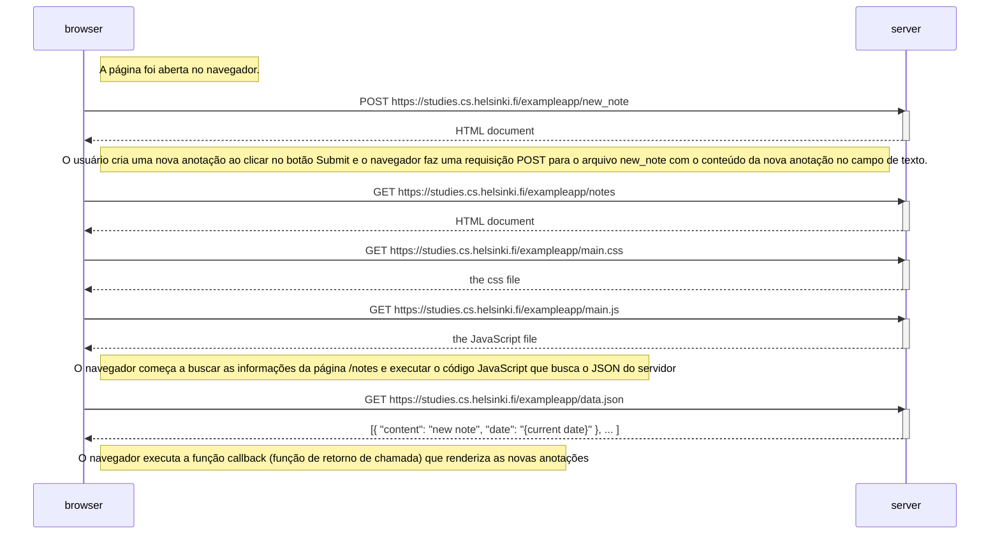

```mermaid
sequenceDiagram
    participant browser
    participant server

    Note right of browser: A página foi aberta no navegador.

    browser->>server: POST https://studies.cs.helsinki.fi/exampleapp/new_note
    activate server
    server-->>browser: HTML document
    deactivate server

    Note right of browser: O usuário cria uma nova anotação ao clicar no botão Submit e o navegador faz uma requisição POST para o arquivo new_note com o conteúdo da nova anotação no campo de texto.

    browser->>server: GET https://studies.cs.helsinki.fi/exampleapp/notes
    activate server
    server-->>browser: HTML document
    deactivate server

    browser->>server: GET https://studies.cs.helsinki.fi/exampleapp/main.css
    activate server
    server-->>browser: the css file
    deactivate server

    browser->>server: GET https://studies.cs.helsinki.fi/exampleapp/main.js
    activate server
    server-->>browser: the JavaScript file
    deactivate server

    Note right of browser: O navegador começa a buscar as informações da página /notes e executar o código JavaScript que busca o JSON do servidor

    browser->>server: GET https://studies.cs.helsinki.fi/exampleapp/data.json
    activate server
    server-->>browser: [{ "content": "new note", "date": "{current date}" }, ... ]
    deactivate server

    Note right of browser: O navegador executa a função callback (função de retorno de chamada) que renderiza as novas anotações
```